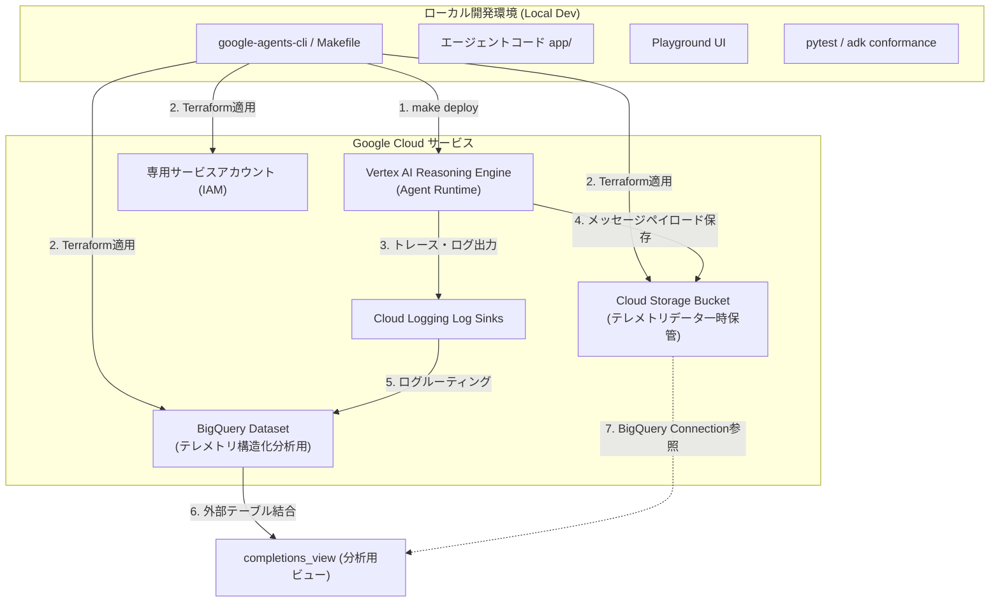

# 🗺️ Google ADK v2.0 & agents-cli 詳細導入・アーキテクチャ解説

> [!IMPORTANT]
> 本ドキュメントは、**Google Agent Development Kit (ADK) v2.0** と **agents-cli (v0.4.0)** を使用したエージェントのローカル開発、環境変数設定、および **Vertex AI Reasoning Engine (Agent Runtime)** への Terraform を用いたデプロイプロセスに関する詳細なリファレンスガイドです。
>
> セットアップやデプロイの流れ、Terraformの動作メカニズムが複雑なため、トラブルを防ぐための注意点も含め詳細に解説しています。

---

## 1. 全体アーキテクチャとプラットフォーム概要

本プロジェクトは、AI エージェントのライフサイクルを統合管理する **Gemini Enterprise Agent Platform** に準拠して構築されています。
本システムでは、開発・実行・運用の各フェーズで以下のコンポーネントが連携します。



### 主要レイヤーの役割
1. **Build: ADK (Agent Development Kit) v2.0**
   * OSS として提供されるエージェント開発フレームワーク。グラフベースの実行エンジン (Workflow Runtime) へ刷新され、エージェントの思考プロセスやツールの呼び出しを決定論的なグラフノードとして実行します。
2. **Scale: Agent Runtime (Vertex AI Reasoning Engine)**
   * エージェントをクラウド上で実行するためのマネージド環境。FastAPI ラッパー (`app/agent_runtime_app.py`) を通じて API サーバーとしてホストされ、スケーリングやセッション管理を自動化します。
3. **Govern & Optimize (Observability / Telemetry)**
   * OpenTelemetry に基づき、エージェントの思考ステップ、Gemini へのリクエスト/レスポンス、トークン消費量、ユーザーからのフィードバックログを透過的に収集します。

---

## 2. セッション (短期記憶) vs メモリバンク (長期記憶)

ADK v2.0 では、会話のコンテキストを維持するために 2 種類の記憶システムを提供しています。
詳細な仕様、短期記憶との違い、および具体的なソースコードの実装例については、以下の専用ドキュメントをご参照ください。

👉 **[詳細解説: セッション vs メモリバンク（MEMORY.md）](./MEMORY.md)**


---

## 3. プロジェクトのディレクトリ構造

`google-agents-cli` で生成されたプロジェクトは、以下の独立性の高い構造を持っています。

```
<project-dir>/
├── agents-cli-manifest.yaml         # エージェントのメタデータとビルドパラメータ
├── Dockerfile                       # クラウドデプロイ用の Docker 構成
├── GEMINI.md                        # AI 開発アシスタント用の指示定義書
├── pyproject.toml                   # uv 用の依存関係定義ファイル
├── Makefile                         # 開発運用タスクをカプセル化した Makefile
│
├── app/                             # エージェントの実装ソースコード
│   ├── __init__.py
│   ├── agent.py                     # エージェントおよびカスタムツールの定義本体
│   ├── agent_runtime_app.py         # Vertex AI Agent Runtime 用の FastAPI ラッパー
│   └── app_utils/
│       ├── telemetry.py             # OpenTelemetry によるオブザーバビリティ設定
│       └── typing.py                # 型定義およびユーティリティ
│
├── deployment/                      # インフラ自動定義ファイル (Terraform)
│   └── terraform/
│       ├── shared/                  # BQスキーマや共通SQLの定義
│       └── single-project/          # 単一プロジェクトデプロイ用の Terraform 定義
│           ├── apis.tf              # 必要な Google Cloud API の有効化
│           ├── iam.tf               # 専用サービスアカウントの作成と権限付与
│           ├── storage.tf           # ログ格納用 GCS バケット定義
│           ├── telemetry.tf         # BigQuery、Log Sink などの監視パイプライン定義
│           ├── service.tf           # Vertex AI Reasoning Engine 自体の定義
│           ├── variables.tf         # Terraform 変数定義
│           └── vars/
│               └── env.tfvars       # ★ プロジェクトIDやリージョンの設定値
│
└── tests/                           # テストコード群
    ├── unit/                        # ユニットテスト (モック実行)
    ├── integration/                 # 統合テスト (実際の API 呼出)
    └── eval/                        # 自動品質評価用データセットおよび定義
```

---

## 4. ローカル開発環境の構築手順

ローカル環境でエージェントを動かすための詳細手順です。

### 1. 必要ツールのインストール
* **Python 3.13**: `uv` が自動で適切なマイナーバージョンを管理します。
* **uv**: 高速な Python パッケージマネージャー。
* **Google Cloud SDK (gcloud)**: GCP 操作用ツール。

### 2. Google Cloud の認証と設定 (最重要)
ADK はローカル実行時にも Gemini API と通信するため、**アプリケーションデフォルト資格情報 (ADC)** とプロジェクト設定が必要です。

```bash
# 1. gcloud にブラウザ経由でログインします
gcloud auth login

# 2. ローカルのプログラムから GCP API を呼ぶための ADC を設定します
gcloud auth application-default login

# 3. 作業対象のプロジェクト ID を明示的に設定します
# ※ agents-cli はこのローカル設定値を参照してデプロイ先プロジェクトを自動判別します。
gcloud config set project YOUR_PROJECT_ID
```

### 3. 環境変数（`.env`）の作成と設定
各プロジェクトフォルダ（`basic-search-agent` または `travel-guide-japan`）に移動し、`.env` ファイルを作成します。

```bash
cd basic-search-agent
cp .env.example .env
```

`.env` の内容を以下のように設定します。

```env
# 実行ターゲットプロジェクトID
GOOGLE_CLOUD_PROJECT="YOUR_PROJECT_ID"
# 実行リージョン（日本国内の asia-northeast1 を指定）
GOOGLE_CLOUD_LOCATION="asia-northeast1"
# Vertex AI サービスの使用フラグ
GOOGLE_GENAI_USE_VERTEXAI="True"
```

---

## 5. ローカルでの実行・検証コマンド

プロジェクトごとに用意された `Makefile` にて、主要な開発コマンドがカプセル化されています。

```bash
# 依存関係のインストール（仮想環境の自動作成とパッケージの同期）
make install

# ローカル Web UI (Playground) の起動
# 起動後、ターミナルに表示される URL (通常 http://localhost:8000 など) にアクセスし対話できます。
make playground

# ユニットテストおよび統合テストの実行
make test

# コードの静的解析とフォーマットチェック
make lint
```

---

## 6. Vertex AI Reasoning Engine へのデプロイ詳細

エージェントを本番環境（Vertex AI）にホスティングするためのメカニズムと、デプロイ時に実行される Terraform の仕組みについて説明します。

### 🚀 デプロイ実行コマンド
```bash
make deploy
```
※ 内部的には `uvx google-agents-cli deploy --no-confirm-project` が実行されます。

---

### 🔍 デプロイメントの裏側 (Terraform による自動構築)

`make deploy` を実行すると、`agents-cli` は裏側で自動的に Terraform (`deployment/terraform/single-project/`) を初期化し、適用します。以下のリソースが順にプロビジョニングされます。

#### 1. 必要な API の自動有効化 (`apis.tf`)
Terraform は以下の API サービスをプロジェクトで自動的に有効化します。これにより、手動で GCP コンソールから有効化する手間が不要になります。
* `aiplatform.googleapis.com` (Vertex AI 本体)
* `cloudbuild.googleapis.com` (エージェントコードビルド用)
* `run.googleapis.com` (Agent Runtime を実行する Cloud Run インフラ)
* `bigquery.googleapis.com` (テレメトリログ格納)
* `logging.googleapis.com` / `cloudtrace.googleapis.com` / `telemetry.googleapis.com` (監視・追跡)

#### 2. 専用サービスアカウントの作成とIAM権限付与 (`iam.tf`)
エージェント専用のサービスアカウント `app-sa` が作成され、以下の最小限の権限が割り当てられます。
* **Vertex AI 利用権限**: `roles/aiplatform.user` (Gemini モデルの呼び出し)
* **ログ書き込み権限**: `roles/logging.logWriter` (Cloud Logging へのログ書き込み)
* **トレース書き込み権限**: `roles/cloudtrace.agent` (Cloud Trace へのスパン送信)
* **ストレージ操作権限**: `roles/storage.objectAdmin` (一時ログバケットへのアクセス)

#### 3. ログ格納用 GCS バケットの作成 (`storage.tf`)
`${project_id}-${project_name}-logs` という名称のバケットが作成されます。エージェントがやり取りした会話データのうち、容量の大きい JSON ペイロード（Completions データ）がここに一時保存されます。

#### 4. テレメトリパイプラインの構築 (`telemetry.tf`)
エージェントの稼働分析を SQL で容易に行うためのデータパイプラインが構築されます（詳細は第7章を参照）。

#### 5. Reasoning Engine (Agent Runtime) の立ち上げ (`service.tf`)
`google_vertex_ai_reasoning_engine` リソースがプロビジョニングされます。
* **初期ブートストラップ**: 初回デプロイ時は、バイナリ破損を防ぐために Base64 エンコードされたダミーのソースコードアーカイブ (`dummy_source.b64`) を用いてインフラの骨組みを作成します。
* **実コードの適用**: インフラ作成完了後、`agents-cli` のデプロイツールが実際の Python ソースコード（`app/` 以下のファイル）と依存関係ファイル (`app/app_utils/.requirements.txt`) をパッケージングしてアップロードし、実行中のランタイムを上書きアップデートします。

---

### ⚠️ 環境変数の二重整合性 (Variable Alignment)

デプロイメントを成功させるためには、以下の 2 つのファイルに定義されている **プロジェクトID** と **リージョン** が完全に一致している必要があります。

1. **`agents-cli-manifest.yaml`** (CLI デプロイ用マニフェスト)
   * `region: asia-northeast1` が記述されています。
2. **`deployment/terraform/single-project/vars/env.tfvars`** (Terraform 変数値ファイル)
   * `project_id = "YOUR_PROJECT_ID"`
   * `region = "asia-northeast1"`
   * `project_name = "basic-search-agent"` (または `travel-guide-japan`)

> [!WARNING]
> 一方のファイルを変更した場合は、必ずもう一方のファイルも同じ値に書き換えてください。
> 特にリージョンが異なっていると、Terraform が別リージョンにリソースを作成しようとし、すでに manifest で定義されている設定と競合してデプロイエラーが発生します。

---

### 💡 インタラクティブプロンプトの回避 (`--no-confirm-project`)

デフォルトの `agents-cli deploy` コマンドは、デプロイ先となる Google Cloud プロジェクト ID を確認するための対話型プロンプト（ユーザーへの Y/N 入力要求）を表示します。
しかし、自動デプロイスクリプトや CI/CD 環境などでは、このプロンプトで処理がブロックされてしまいます。

これを回避するため、`Makefile` の `deploy` ターゲットには以下のように `--no-confirm-project` フラグが指定されています。

```makefile
deploy:
	uvx google-agents-cli deploy --no-confirm-project
```

このフラグを指定することで、ローカルの `gcloud config` もしくは環境変数から検出されたプロジェクト ID に対して、**確認プロンプトをスキップして即時に自動デプロイ**を実行することができます。

---

## 7. テレメトリーとオブザーバビリティの仕組み

本プロジェクトは、運用中のエージェントの挙動を監視するため、以下の高度なテレメトリ収集システムが組み込まれています。

1. **インテリジェントなログルーティング**:
   * エージェントの動作ログのうち、Gemini とのメッセージのやり取り（Inference Operations）のみを抽出する **Cloud Logging Log Sink** (`google_logging_project_sink.genai_logs_to_bq`) が作成され、BigQuery dataset へリアルタイム転送されます。
2. **BigQuery Connection による GCS データ連携**:
   * メッセージの生ペイロードは BigQuery から参照可能な **GCS 外部テーブル** (`google_bigquery_table.completions_external_table`) として定義されます。
3. **分析用ビュー (`completions_view`)**:
   * Cloud Logging から転送されたメタデータと、GCS に保存された生メッセージの JSON データを結合 (Join) し、SQL 一発で「いつ、どのセッションで、ユーザーが何を言い、Gemini がどうツールを呼んで、どう応答したか」を一覧できる便利なデータベースビューが自動生成されます。

---

## 8. トラブルシューティング

### Q. デプロイ時に「Vertex AI Reasoning Engine API is not enabled...」のようなエラーが出る
**原因**: API の有効化が完了する前にリソースの作成が走ったか、または権限不足です。
**対策**: 初回デプロイ時は API 有効化の伝播に 1〜2 分かかる場合があります。少し時間をおいて再度 `make deploy` を実行してください。

### Q. 「GOOGLE_CLOUD_PROJECT is not set」や「ProjectId cannot be detected」エラーで失敗する
**原因**: ローカルの `gcloud` に有効なプロジェクト ID が設定されていないか、認証の有効期限が切れています。
**対策**:
1. `gcloud config set project YOUR_PROJECT_ID` を再実行。
2. `gcloud auth application-default login` を再実行して認証トークンを更新します。

### Q. ローカル実行時に `ModuleNotFoundError` が発生する
**原因**: `pyproject.toml` に記述されたパッケージがローカル仮想環境（`.venv`）に正しくインストールされていません。
**対策**: プロジェクトディレクトリで `make install` を実行し、環境を再同期させてください。

---

## 9. 💰 コスト・運用・開発上の注意点 (Cautions & Gotchas)

本プロジェクトは学習・検証用のサンプル構成となっていますが、Google Cloud 上での利用や開発を進めるにあたって、以下の料金・運用上の注意点があります。

### 1. Google Search Grounding (Web検索ツール) の料金 (最重要)
* **概要**: エージェント（`search_agent` や `food_agent` 等）は、最新情報を得るために **Google Search Grounding（Google検索 grounding）** ツールを使用しています。
* **課金ルール**: Vertex AI において Google Search Grounding を有効にしたリクエストは、月 **5,000 プロンプトの無料枠**を超過すると **1,000クエリあたり $14 USD（1クエリあたり約 $0.014 USD）** の追加料金が発生します（料金は変更される場合があります。最新情報は [Vertex AI 料金ページ](https://cloud.google.com/vertex-ai/generative-ai/pricing) をご確認ください）。
* **注意点**: 開発の初期テストやループ処理のデバッグでエージェントを何度も起動してテストを行うと、想定外の金額が課金される恐れがあります。検証時には意図しない連投や無限ループに陥らないよう監視してください。

### 2. コンピュート料金とカスタムデプロイ (`deploy.py`) による Scale-to-Zero
* **概要**: Vertex AI Reasoning Engine (Agent Runtime) は Cloud Run 上にホストされます。標準の `agents-cli deploy` コマンドを使用すると、デフォルトで「常時稼働（`min-instances=1`）」と「メモリ 4Gi」が割り当てられ、アイドル時でもコンピュート料金が発生します。
* **最適化済み**: これを防ぐため、応用プロジェクト (`travel-guide-japan`) では `make deploy` 実行時に独自の **`deploy.py`** スクリプトを経由する設計にしています。このスクリプトが裏側で `--min-instances=0` (Scale-to-Zero) とメモリ削減 (`2Gi`) を強制指定し、Terraform の設定が標準デフォルト値で上書きされないように守ることで、アイドル時の**コンピュート料金が完全にゼロ**になるよう最適化されています。

### 3. ストレージ料金とクリーンアップ対策 (GCS & BigQuery)
* **概要**: テレメトリ（動作記録・監視データ）を格納するために Cloud Storage および BigQuery にデータが保管されます。
* **BigQuery 削除対策**: 通常、ログシンク経由で自動生成されたテーブルを含む BigQuery データセットは、空ではないため `terraform destroy` 時にエラーで削除に失敗します。本プロジェクトではこれを防ぐため、両プロジェクトの `telemetry.tf` 内で **`delete_contents_on_destroy = true`** を指定し、リソースのクリーンアップが正常に行えるよう配慮しています。
* **注意点**: 不要になったインフラは `terraform destroy` などで削除することをお勧めします。


### 4. 新規ライブラリ追加時の依存関係の同期
* **概要**: `google-agents-cli` のデプロイプロセスは、ローカルの Python環境ではなく、`pyproject.toml` に定義された依存関係を自動的に収集してクラウドに転送します。
* **注意点**: ローカル環境でパッケージを追加した場合（例: `uv add`）、必ず `pyproject.toml` に依存関係が書き込まれていることを確認してください。書き込まれていない場合、デプロイ後の実行時に `ModuleNotFoundError` となります。また、C拡張などを必要とする OS 依存の重いライブラリはデプロイ時にビルドエラーとなる可能性があるため、注意してください。

