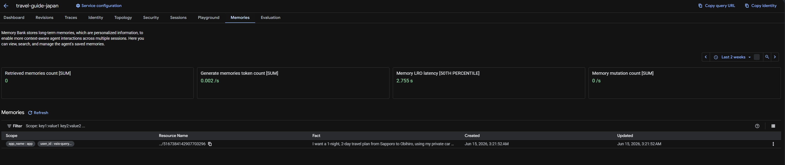
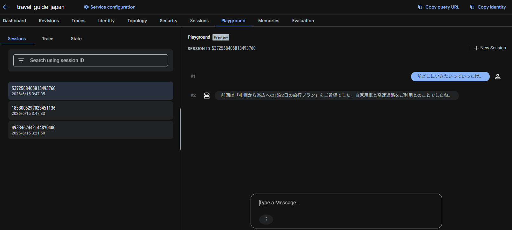

# セッション (短期記憶) vs メモリバンク (長期記憶)

ADK v2.0 では、会話のコンテキストを維持するために 2 種類の記憶システムを提供しています。これらは明確に使い分ける必要があります。



| 項目 | セッション (短期記憶 / Short-term Session) | メモリバンク (長期記憶 / Long-term Memory Bank) |
| :--- | :--- | :--- |
| **生存期間** | 1つの会話スレッドの開始から終了まで | 明示的に削除しない限り、永続的に保持 |
| **格納されるデータ**| 会話の中でやり取りされた生のメッセージ履歴 | 会話から抽出・要約されたユーザーの嗜好、属性、事実 |
| **動作方式** | Agent Runtime 側で自動的に管理・永続化されます。 | `after_agent_callback` や `PreloadMemoryTool` を介して明示的に保存・読み込みます。 |
| **管理単位** | `session_id` (会話スレッド単位) | `user_id` (ユーザーアカウント単位) |
| **ユースケース** | 直前の指示への応答、文脈の理解 | ユーザーの過去の旅行日程やアレルギー、移動手段の好みのパーソナライズ |

## 実装例 (`travel-guide-japan`)

### ① メモリの自動保存 (コールバック)
エージェントの応答が完了すると、`generate_memories_callback` が走り、会話イベントがメモリバンクに送られます。
```python
async def generate_memories_callback(callback_context: CallbackContext):
    # 直近のイベント（ユーザーの発言やエージェントの返答）をメモリに保存
    await callback_context.add_events_to_memory(
        events=callback_context.session.events[-5:-1]
    )
```

### ② メモリの自動読み込み (ツール)
新しい会話が始まると、エージェント定義内の `PreloadMemoryTool()` が自動的にメモリバンクから `user_id` に紐づく記憶をロードし、Gemini のシステム指示（システムプロンプト）に文脈として組み込みます。
```python
root_agent = Agent(
    name="japan_guide",
    model=Gemini(model="gemini-2.5-flash"),
    tools=[
        AgentTool(agent=search_agent),
        AgentTool(agent=weather_agent),
        PreloadMemoryTool(),                         # 記憶を自動的にロードするツール
    ],
    after_agent_callback=generate_memories_callback  # 会話終了時に記憶を保存するコールバック
)
```

### ③ 実際の動作イメージ

