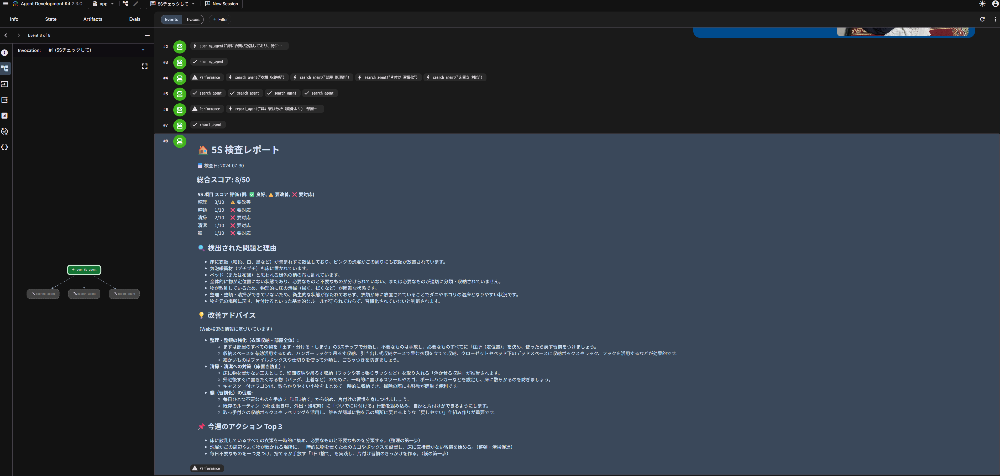

# room-5s-agent

部屋やデスク周りの写真をアップロードするだけで、AIが「5S（整理・整頓・清掃・清潔・躾）」の観点から状態を分析し、スコアカード付きの具体的な改善アクションレポートを自動生成するマルチエージェントシステムです。

本プロジェクトは、製造現場やオフィスにおける「B2B向けの5S点検・予知保全ソリューション」のプロトタイプ（PoC）として設計されています。

## 出力イメージと実行結果

ユーザーがPlayground上で画像を添付し、「この部屋の5Sチェックをして」と送信すると、以下のようなレポートが返却されます。

```markdown
# 🏠 5S 検査レポート
📅 検査日: 2026-06-19

## 総合スコア: 62/100 ⭐⭐⭐

| 5S 項目 | スコア | 評価      |
|--------|-------|----------|
| 整理   |  6/10 | ⚠️ 要改善 |
| 整頓   |  8/10 | ✅ 良好   |
| 清掃   |  5/10 | ❌ 要対応 |
| 清潔   |  7/10 | ✅ 良好   |
| 躾     |  9/10 | ✅ 優秀   |

## 🔍 検出された問題
1. デスク右側に書類が山積み（整理 -2点）
2. 床にケーブルが散乱（清掃 -3点）

## 💡 改善アドバイス（Web 検索より）
- 書類トレーを導入するとデスクがスッキリ整理できます。
- ケーブルクリップで床のケーブルを壁沿いに固定することで、清掃がしやすくなります。

## 📌 今週のアクション Top 3
1. [ ] 床のケーブルを結束バンドやクリップでまとめる
2. [ ] 不要な書類を分類し、シュレッダーにかける
3. [ ] 机の上を拭き掃除する
```

### 実際のUIでの実行結果



## アーキテクチャの工夫: マルチモーダル × 協調エージェント

本プロジェクトは、Gemini のマルチモーダル（画像認識）機能と、ADK v2.0 の協調エージェント（Collaborative Agents）パターンを組み合わせています。
1つの巨大なプロンプトで処理するのではなく、それぞれの専門タスクに特化したエージェントに役割を分割することで、精度の向上とオブザーバビリティを確保しています。

1. **`root_agent` (画像解析 & オーケストレーター)**
   ユーザーからの画像を受け取り自ら画像解析（Vision）を行って物理的状態を抽出。その後、以下の3つのサブエージェントを順番に呼び出して情報を統合します。
2. **`scoring_agent` (5S評価)**
   抽出された物理状態をもとに、「整理・整頓・清掃・清潔・躾」の各項目を10点満点で採点し、減点理由を特定します。
3. **`search_agent` (改善案の検索)**
   スコアが低かった項目に対して、`google_search` を用いてWebから具体的な改善アイデアや収納グッズを検索します。
4. **`report_agent` (レポート統合)**
   すべての情報（スコア、理由、検索された改善アイデア）を統合し、見やすいMarkdown形式のアクションレポートを出力します。

### 💡 設計の背景: なぜ `root_agent` が Vision（画像解析）を兼任しているのか？

今回の構成で、専用の `vision_agent` ではなく `root_agent` に画像解析を任せているのには、ADK v2のアーキテクチャ上の理由があります。

- **`AgentTool` の制約**: サブエージェントを呼び出す `AgentTool` は、裏側でLLMの Function Calling を利用しています。関数呼び出しの引数はJSON（テキスト）形式である必要があるため、画像のバイナリデータそのものを動的にサブエージェントへ引き渡すことはできません。
- **PoCとしての解決策**: 今回は「ユーザーに見えない裏側でサブエージェントを連携させ、最後に一度だけレポートを返す（Orchestrator-Workerパターン）」を実現するため、ユーザー入力を直接受け取る `root_agent` 自身にVision解析を担わせ、その結果のテキストをサブエージェントに渡す構成としています。
- **将来（プロダクション版）の解決策**: 本格的な製品版では、ユーザーがアップロードした画像をまず Cloud Storage (GCS) 等に保存し、そのURI（`gs://...`）をテキストとして専用の `vision_agent` に渡す設計がベストプラクティスとなります。または、主導権と会話履歴を完全に委譲する `TransferToAgentTool` を用いるアプローチも有効です。

## 開発・実行手順

本プロジェクトの前提条件やツールのインストール方法については、リポジトリルートの **[README.md](../README.md)** をご参照ください。

### ローカルでの動作確認（Playgroundの利用方法）

1. `make playground` でローカルサーバーを起動します。
2. ブラウザでPlaygroundのチャットUIが開きます。
3. チャットの入力欄にある**クリップボード（または添付アイコン）**から、検証したい部屋やデスクの画像をアップロードします。
4. 「5Sチェックをお願い」とテキストを添えて送信すると、AIが画像を解析しレポートを出力します。

## デプロイとクラウド上での検証

クラウド（Vertex AI Reasoning Engine）へのデプロイは、以下のコマンドを実行します。

```bash
gcloud config set project <your-project-id>

# デフォルト設定（CPU: 1, メモリ: 2Gi）でデプロイする場合
make deploy

# リソースやインスタンス数をカスタマイズしてデプロイする場合の例
make deploy ARGS="--cpu 2 --memory 4Gi --min-instances 0 --max-instances 5"
```
※本プロジェクトも `travel-guide-japan` と同様に、`deploy.py` を経由したコンピュート課金の最適化（Scale-to-Zero）に対応しています。

### ⚠️ クラウド上でのテストに関する注意点 (2026-06-19 時点)

GCPコンソール上の Vertex AI Reasoning Engine の標準 Playground UI は、現状 **テキスト入力のみのサポート** となっており、画像のアップロード（クリップアイコン等）に対応していません。

そのため、デプロイしたエージェント（クラウド版）に対して画像を送ってテストする場合は、以下のいずれかの方法を使用してください。

1. **ローカルの Playground を使用**: `make playground` で起動するローカル用UIはマルチモーダル入力（画像アップロード）に完全対応しています。デプロイ前の動作確認にはこちらを使用してください。
2. **REST API / Python SDK を使用**: デプロイされたエンドポイント (`projects/.../reasoningEngines/...`) に対して、プログラムから直接画像バイナリまたはGCS URIを含めてリクエストを送信します。
