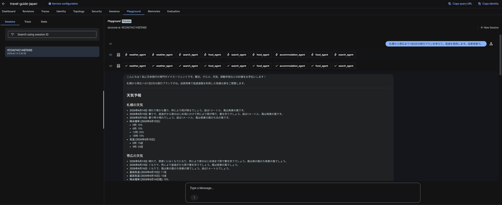
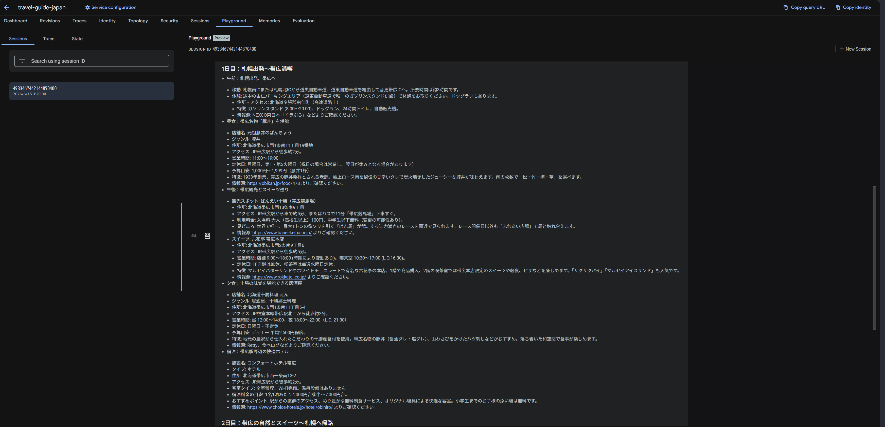

# travel-guide-japan

シンプルな ReAct エージェント
`agents-cli` バージョン `0.4.0` を用いて生成されたエージェント

## プロジェクト構造

```
travel-guide-japan/
├── app/         # エージェントのコアコード
│   ├── agent.py               # エージェントのメインロジック
│   ├── agent_runtime_app.py    # Agent Runtime アプリケーションロジック
│   └── app_utils/             # アプリケーションのユーティリティとヘルパー
├── tests/                     # ユニットテスト、統合テスト、負荷テスト
├── GEMINI.md                  # AI支援開発用ガイド（プロンプト・コンテキスト）
└── pyproject.toml             # プロジェクトの依存関係定義
```

> 💡 **ヒント:** AI支援開発には [Gemini CLI](https://github.com/google-gemini/gemini-cli) を使用してください。本プロジェクトの文脈やルールはあらかじめ `GEMINI.md` に設定されています。

## 開発・実行手順

本プロジェクトの実行環境の要件（Python 3.13等）、前提条件ツールのインストール方法、およびローカル起動（Playground）や基本コマンド群については、リポジトリルートの **[README.md](../README.md)** をご参照ください。

## デプロイ

```bash
gcloud config set project <your-project-id>

# デフォルト設定（CPU: 1, メモリ: 2Gi）でデプロイする場合
make deploy

# リソースやインスタンス数をカスタマイズしてデプロイする場合の例
make deploy ARGS="--cpu 2 --memory 4Gi --min-instances 1 --max-instances 5"
```

CI/CD や Terraform を追加する場合は `agents-cli scaffold enhance` を実行してください。
本番用のインフラを自動構築する場合は `agents-cli infra cicd` を実行してください。

## セッション (短期記憶) vs メモリバンク (長期記憶)

ADK v2.0 では、通常の「セッション（会話スレッドごとの短期記憶）」に加えて、ユーザー単位で恒久的に文脈を学習する「**メモリバンク（長期記憶）**」という強力な機能が提供されています。

本プロジェクトでの具体的な実装例や、短期記憶との違いについての詳しい解説は、ルートディレクトリの **[詳細解説: セッション vs メモリバンク（docs/MEMORY.md）](../docs/MEMORY.md)** をご参照ください。

## アーキテクチャの工夫: サブエージェントによる検索の分離

本プロジェクトでは、ADK v2 の機能を活用し、Google 検索専用のサブエージェント（`search_agent` など）を定義し、親エージェント（`root_agent`）から Function Calling として呼び出す**「検索コンテキストの分離アーキテクチャ」**を採用しています。

この設計を採用している背景には、エンタープライズ特有のコンプライアンス要件と API の仕様が深く関係しています。

- **データレジデンシー（地域制限）と API の制約**
  最新の Gemini 3 シリーズでは、1つのエージェント内で「Google Search Grounding（Web検索）」と「Function Calling（カスタムツール）」を同時に利用することが公式にサポートされています。しかし、検索機能を利用すると**クロスジオグラフィー・ルーティング（米国などのグローバルインフラへの一時的なデータ転送）** が発生する可能性があります。
  金融や官公庁など、データが日本国内（`asia-northeast1`）から外に出ることをポリシー上許可できない厳格な要件下では、地域固定が保証された **Gemini 2.5 などの特定モデル** を採用する必要があります。しかし、これらの要件下では両機能の「同時利用制限」に抵触してしまうというジレンマがありました。

- **エンタープライズ・ベストプラクティスとしてのオーケストレーション**
  このコンプライアンス要件と技術的制約をエレガントに解決するための推奨アーキテクチャが、本プロジェクトで実装されている手法です。
  1. **サブエージェントへの委譲**: `tools=[google_search]` のみを持つ検索タスク特化のサブエージェントを作成する。
  2. **親エージェントの専念**: 親は検索ツールを直接持たず、代わりに `AgentTool(agent=search_agent)` の形でサブエージェントを**関数呼び出し**として実行する。

これにより、厳格なデータレジデンシー（地域制限）要件を遵守するためのモデル制約をクリアしつつ、自動関数呼び出し（AFC）による予期せぬエラーも防ぐことができます。さらに、検索の役割（グルメ専用、宿泊専用など）を細分化することで、エージェントの自律性と表現力を最大限に引き出すことが可能になっています。

## オブザーバビリティ (監視・分析)

Cloud Trace、BigQuery、Cloud Logging への組み込みテレメトリ・エクスポート機能を備えており、エージェントの挙動を詳細に分析可能です。


## 実行結果



